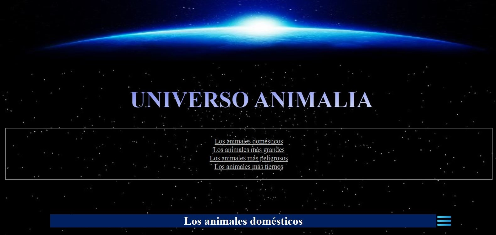

# Animalia
Primera página web

¿Este proyecto? Introducción.

  
Creación de primera página web utilizando **HTML** y **CSS**.

¿Este proyecto es útil?

  
Los lenguajes más importantes en el desarrollo de páginas web son HTML y CSS, por lo que es necesario tener un acercamiento inicial a estas herramientas con ejemplos que nos permitan experimentar y conocer a detalle sus funciones e importancia en la presentación de información, ya que, en la actualidad, tener una página web amplia las oportunidades de difusión, venta u otros beneficios para diferentes negocios.

Esta página se desarrolló con el objetivo de abordar los conceptos y herramientas básicas para la creación de páginas web, empleando **Visual Studio Code** como entorno de desarrollo. Pretende presentar una alternativa de página web que sirva de guía para otros programadores y programadoras que deseen incursionar en **Frontend**.

¿Cómo comenzar con el proyecto?

  
Es recomendable iniciar identificando y explorando las partes principales que integran la página, que son:

- **Header.** Contenido introductorio de la página web.
- **Body.** Contenido principal de la página web.
- **Footer.** Contenido al final de la página web.

Exploración de las etiquetas **h** para los títulos, **p** para los párrafos, así como el uso de las clases e identificadores empleados para dar estilo a la página por Css.

Adicional a esto, se agregó una fuente de texto externa al código para las letras, así como la exploración de funciones Css para fijación de imágenes, formato de listas y transparencia de bloques.

¿Ayuda para usuarios? Documentación previa.

  
Estas son las páginas de las que me ayudé para realizar el proyecto.

[Fuentes de texto externas](https://fonts.google.com/).

[Paletas de colores en hexadecimal](https://colorhunt.co/).

¿Quién mantiene y contribuye con el proyecto?

  
**Tecnolochicas** ha contribuido enormemente para el desarrollo de este proyecto, aportando los conocimientos básicos en Html y Css para su creación. Agradezco mucho la oportunidad de colaboración.

[Tecnolochicas](https://tecnolochicas.mx/).

¿Beneficios y desventajas de las herramientas utilizamos?

  
Aprendiendo los conceptos clave del desarrollo web con Html y Css, es posible agregar elementos a la página web, incluir imágenes y cambiar su estilo rápidamente, según la necesidad que se desea cubrir, así como modificar su estructura de ser necesario.

Vistas previas.

  
.  
[Vista en navegador](https://universo-animalia.netlify.app/).

